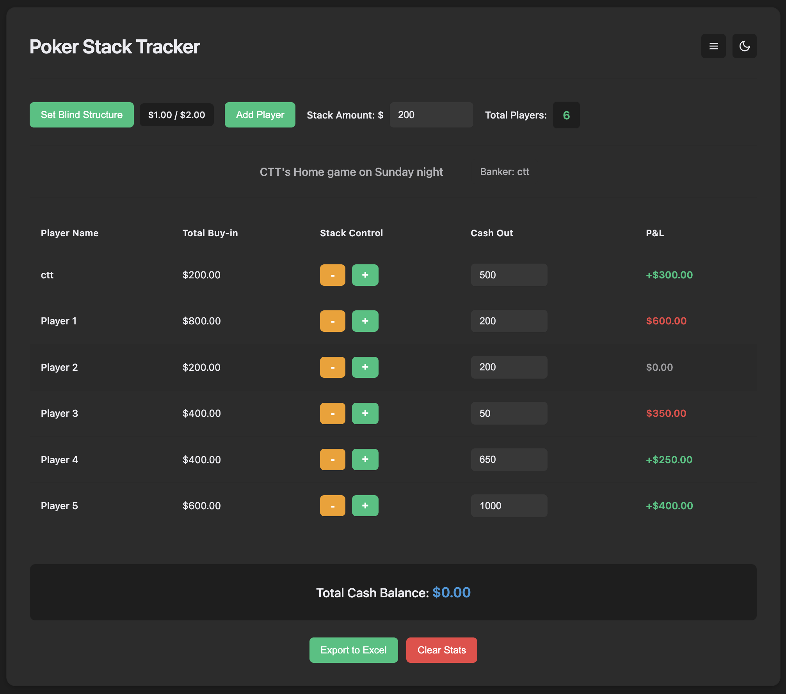

# Poker Stack Tracker

A minimalist web application for tracking chip stacks during poker games.

## Features

- **Blind Structure**: Set small and big blind amounts, or pick a 0.5/1, 1/2, 1/3, 2/5 preset (sets the default stack too)
- **Rake**: Mark a session as no-rake or rake (time, pot % with cap, flat fee, or a custom note). Chosen when creating a room and from the session chip in solo
- **Sign-in**: When Firebase is configured, Google or email is required before the tracker. Create an email account with a unique display name, then verify the email before the tracker unlocks. Google users pick a display name if they do not have one yet. You can change it later in Settings. Nobody else can use that name until you change it
- **Player Management**: Add players with their buy-in amounts. Tap a player's total buy-in to type a new amount
- **Dealer and Host**: Always-on house rows (default $0, never negative) for tips and host pay. Count toward cash balance, not player count
- **Stack Tracking**: Track total buy-ins with +/- stacks or by typing, plus undo for the last buy-in change
- **Cash Out Tracking**: Record cash-out amounts for each player
- **P&L Calculation**: Automatic profit and loss calculation per player
- **Balance Overview**: Buy-ins, player cash-outs, house take, and leftover
- **Settlement**: Who pays whom after cash-out, including Dealer and Host. Tick Paid when cash has changed hands. Copy the results for WhatsApp. Chop leftover among winners by P&L share so the books close
- **Session clock**: Start, pause (becomes Resume), and reset elapsed time (used for time-rake hints)
- **Action clock**: Header clock button opens a full-screen countdown (30s, 60s, 120s, or custom; default 60s) when a player is on the clock
- **Data Persistence**: Automatically saves game state to browser localStorage
- **Rooms (multi-device sync)**: Create a 4-digit room code so other phones join the same live session; the room host edits by default and can grant edit access. Seat someone already in the room from Add Player. One account can host 3 rooms at a time; each room is deleted after 1 week.
- **Responsive Design**: Works on desktop and mobile devices
- **Progressive Web App (PWA)**: Installable as a native app on your phone
- **Offline Support**: Works offline with service worker caching (solo mode)
- **Dark/Light Mode**: Toggle between dark and light themes
- **Compact Mode**: Toggle between normal and compact font sizes

## Rooms (optional)

If `firebase-config.js` is empty, the app stays local with no account. When Firebase is filled in:

1. Follow **[ROOM_SETUP.md](ROOM_SETUP.md)** (Google / email Auth + Firestore)
2. Sign in with Google, or create an email account, verify the email, and set your display name
3. **Room → Create room** (your unique display name is shown, not edited there), share the code. Limit: 3 rooms per account; rooms last 1 week then delete themselves
4. Others sign in, **Join** as viewers; the room host uses **People** to allow edit when needed

Product model: a **Room** is one live session (not a persistent Club). A Club layer can be added later on top of rooms.

## Installation as PWA

This app can be installed on your phone as a Progressive Web App (PWA):

### On iOS (Safari):
1. Visit the site on your iPhone/iPad
2. Tap the Share button
3. Select "Add to Home Screen"
4. The app will appear on your home screen like a native app

### On Android (Chrome):
1. Visit the site on your Android device
2. You may see an "Install" prompt, or
3. Use the menu (⋮) → "Add to Home Screen" or "Install app"
4. The app will be installed and work offline

## Deployment

This site is deployed on GitHub Pages at: https://ctt062.github.io/Poker-Stack-Tracker/

## License

MIT License

